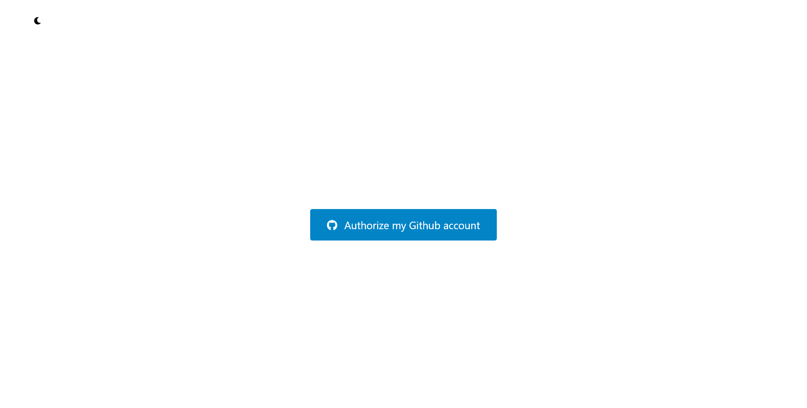
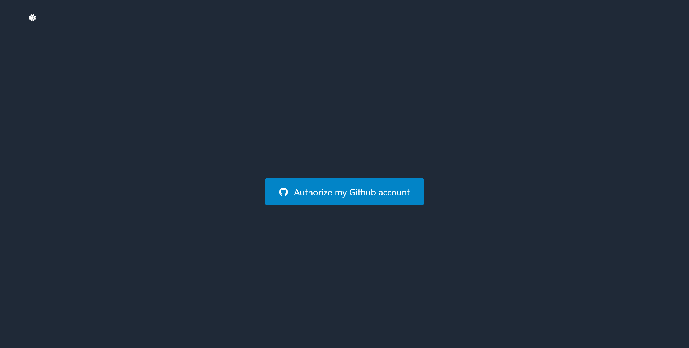
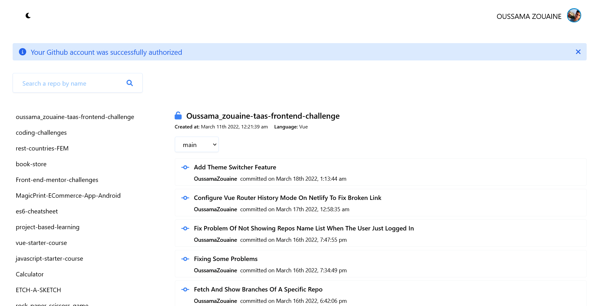
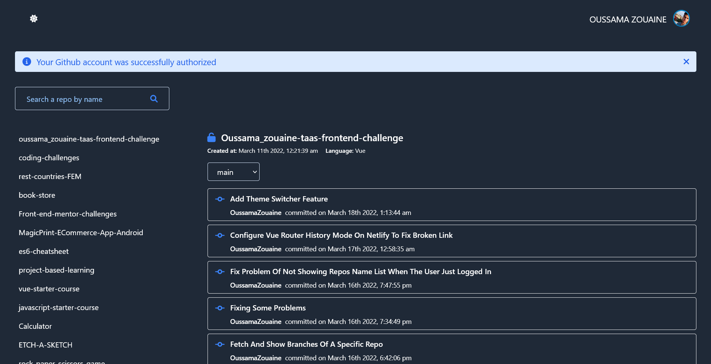

# taas-frontend-challenge

this is a web app developed with VueJS and firebase auth service, that allows a user to authenticate throw github and see repos that he has in his github account also see the commits history in each repo.

## Features

-   A user can authorize his github account then list his repositories with ability to filter by name.
-   A user can select a repository from the list, then it shows the branches and the commits history
-   A user can click on repo name and navigate to the actual rep in github
-   A user can click on a commit message and navigate to github to see the changes was made by that commit
-   A user can toggle theme between dark and light
-   A user can log out

## What I used

`HTML` `CSS` `Javascript` `VueJS` `Vue-Router` `Vuex` `TailwindCSS` `Firebase Auth` `Github Rest api`

## Project setup

```
npm install
```

### Compiles and hot-reloads for development

```
npm run serve
```

### Compiles and minifies for production

```
npm run build
```

## Screenshots

| Light Mode                                                       | Dark Mode                                                      |
| ---------------------------------------------------------------- | -------------------------------------------------------------- |
|  |  |
|  |  |

### Customize configuration

See [Configuration Reference](https://cli.vuejs.org/config/).
